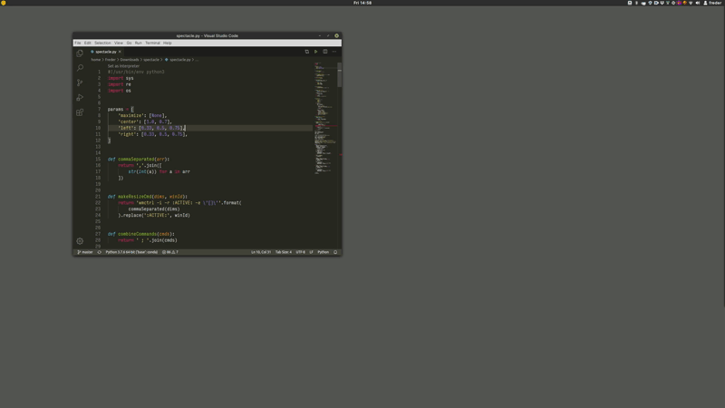

linux implementation of my [spectacle](https://www.spectacleapp.com/) setup, using [wmctrl](https://sites.google.com/site/tstyblo/wmctrl).

requirements:
- xrandr
- python3
- wmctrl



```
./spectacle.sh maximize
./spectacle.sh center
./spectacle.sh left
./spectacle.sh right
```

call each command multiple times to cycle through different sizes.
